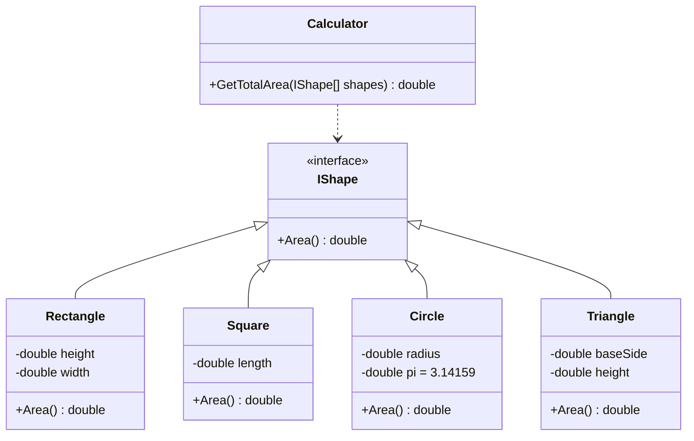

# AreaCalculations

## 問題
Implement:  
```csharp
Calculator.GetTotalArea()
```
Define the different shapes: `Square`, `Rectangle`, `Circle` and `Triangle`

[Link](https://www.codewars.com/kata/tdd-area-calculations/csharp)

## 類別圖


## 驗收測試
```gherkin
Feature: Calculate the area of different shapes.
  Four shapes: Rectangle, Square, Circle, Triangle.

  Scenario: Calculate Rectangle
    Given There is a rectangle, height is 3 cm, and width is 5 cm
    When Calculate area
    Then The area is 15 square cm

  Scenario: Calculate Square
    Given There is a square, and length is 3 cm
    When Calculate area
    Then The area is 9 square cm

  Scenario: Calculate Circle
    Given There is a circle, and radius is 4 cm 
    When Calculate area
    Then The area is 50.27 square cm

  Scenario: Calculate Triangle
    Given There is a triangle, height is 4 cm, and base-side is 5 cm
    When Calculate area
    Then The area is 10 square cm

  Scenario: Calculate different shapes
    Given There is a rectangle, height is 3 cm, and width is 5 cm
    And There is a rectangle, height is 4 cm, and width is 8 cm
    And There is a square, and length is 3 cm
    And There is a circle, and radius is 4 cm
    And There is a triangle, height is 4 cm, and base-side is 5 cm
    When Calculate area
    Then The area is 116.27 square cm

  Scenario: Calculate shapes and rounded to two decimal places 四捨五入到小數第二位
    Given There is a rectangle, height is 3.251 cm, and width is 1 cm
    And There is a circle, and radius is 1 cm
    When Calculate area
    Then The area is 6.39 square cm

  Scenario: No shapes 
    Given There is no shape
    When Calculate area
    Then The area is 0 square cm
```